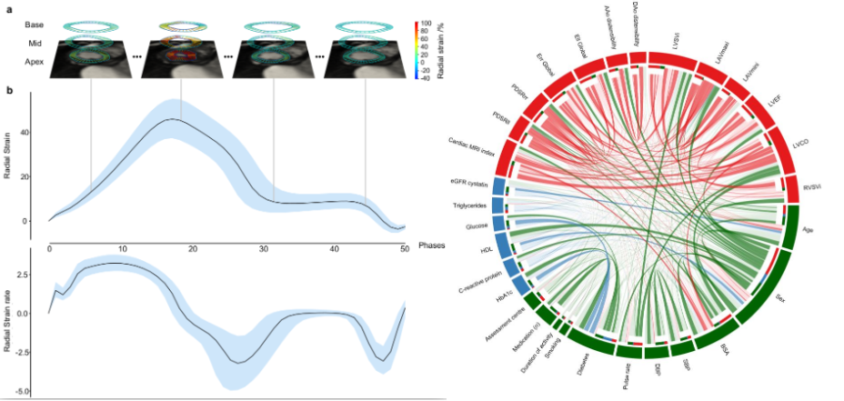

# Genetic and environmental determinants of diastolic heart function

> Abstract

Left ventricular diastolic function is a key determinant of ventricular pressures and stroke volume, and abnormal diastolic function is related to many cardiovascular disease processes and is associated with poorer outcomes. The genetic architecture of diastolic function is largely unknown and so we investigated this in a genome wide association study of cardiac motion phenotypes in 39,000 subjects from UK Biobank. We identified xx significant loci containing genes associated with... Network analyses revealed the relationship between diastolic function and multiple cardiovascular and environmental risk factors. Our results provide insights into the genetic and environmental architecture of diastolic function that are relevant to cardiovascular disease and ageing.   

*Left fig - Motion analysis of cardiac magnetic resonance imaging performed on left ventricular short-axis cines. a) An example from one individual where deep learning segmentation and image registration were used to determine the radial components of myocardial deformation. Data from the basal, mid-ventricular, and apical levels are shown at four representative phases from the 50 acquired. B) Radial strain and strain rate (first derivative of strain) for all UK Biobank subjects (median and interquartile ranges, n=39,559 individuals. Right fig - Circular plot visualization showing the associations between the imaging and the non-imaging phenotypes. The strength of the connection between each pair is presented as a ribbon, whose size, color, and location are proportional to their beta coefficient. All associations with a beta coefficient less than 0.4 (apart from the associations between PDSR_ll, PDSR_rr, and LAVmax_indexed and all other phenotypes) are presented in faint lines in the background.*

## Content

The repository is composed from different sections 
 
* [Cardiac Image anaysis](https://github.com/baiwenjia/ukbb_cardiac). 
Automated pipeline for image segmentation and motion analysis.

* [Peak detection](https://github.com/ImperialCollegeLondon/diastolic_genetics/tree/master/peak_detection) Automated peak detection alghortim to obtain the diastolic peak.
. 

* [Phenotype anaysis](https://github.com/ImperialCollegeLondon/diastolic_genetics/tree/master/phenotype_analysis). 
Cardiac phenotype pipeline to investigate the relationships between the myocardial diastolic function parameters and the non-imaging clinical data.

* [Genetic anaysis](https://github.com/ImperialCollegeLondon/diastolic_genetics/tree/master/genetic_analysis). 
Genome-wide association study (GWAS) analysis for the derived diastolic function traits.

* [Plots](https://github.com/ImperialCollegeLondon/diastolic_genetics/tree/master/plots)
Scatter and box plots of diastolic function.

## Release History

* 0.0.1 

## Meta

Distributed under the GNU GENERAL PUBLIC LICENSE license. See ``LICENSE`` for more information.

