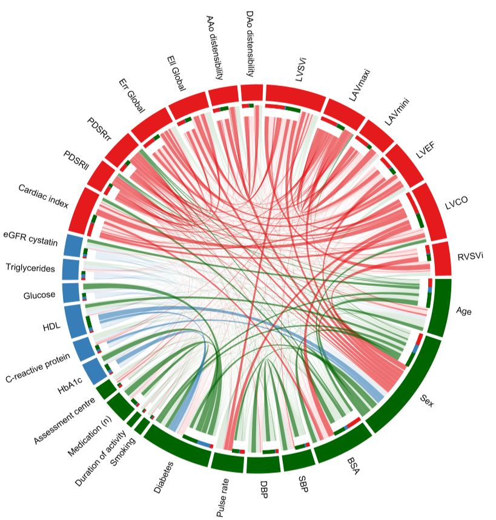

# Cardiac Phenotype associations Pipeline
## Multiple linear regression analysis

    # load data for multiple linear regression analysis

    lm_l<-lm(PDSRll~Age+Sex+BSA+SBP+DBP+Pulse_rate+Diabetes+Smoking+Number_Medication+Moderate_activity+Vigorous_activity+Assessment_centre, data=multidata)
    co_l<-coef(lm_l, complete=TRUE)
    pval<-anova(lm_l)$`Pr(>F)`
    slml<-summary(lm_l)
    confint(lm_l,level=0.95)

    lm_r<-lm(PDSRrr~Age+Sex+BSA+SBP+DBP+Pulse_rate+Diabetes+Smoking+Number_Medication+Moderate_activity+Vigorous_activity+Assessment_centre, data=multidata)
    co_r<-coef(lm_r, complete=TRUE)
    pvalr<-anova(lm_r)$`Pr(>F)`
    slmr<-summary(lm_r)
    confint(lm_r,level=0.95)

    lm_la<-lm(LAVmaxi~Age+Sex+BSA+SBP+DBP+Pulse_rate+Diabetes+Smoking+Number_Medication+Moderate_activity+Vigorous_activity+Assessment_centre, data=multidata)
    co_la<-coef(lm_la, complete=TRUE)
    pvalla<-anova(lm_la)$`Pr(>F)`
    slmla<-summary(lm_la)
    confint(lm_la,level=0.95)

## Multivariate analysis using LASSO models with stability selection for selecting the imaging phenotypes
### Stability selection procedure using 'stabsel'

    # load non-imaging phenotype data
    pheno<-as.matrix(data_pheno)
    library(stabs)
    # for PDSRll (s-1)
    library(stabs)

    stab.glmnet <- stabsel(x=pheno[,-1], y=pheno[,1] ,
                          fitfun = glmnet.lasso,
                          args.fitfun = list(alpha=1),
                          cutoff = 0.75, PFER =1, B=100)

    pheno_long<-as.data.frame(stab.glmnet$selected) # repeat for PDSRrr
    pheno_radial<-as.data.frame(stab.glmnet$selected) # repeat for LAVmaxi
    pheno_lav<-as.data.frame(stab.glmnet$selected) # bind all the variables selected from the stabsel
    pheno_all<-rbind(pheno_long,pheno_radial,pheno_lav)

    pos_pheno<-match(rownames(pheno_all),colnames(pheno)) # order the position of variables selected

 ### LASSO models using 'glmnet'. The parameter of lambda.min was tuned by a 10-fold cross-validation method using 'cv.glmnet' on a training set (~67% of the original dataset).

   
    ## load data for training and for analysis
    ## covar: position of the covariates to bind with position of phenotypes for analysis
    position_stab<-rbind(covar,pos_pheno)
    
    ## Final check for collinearity using the selected variables

    model<-lm(`PDSRll (s-1)`~., data=as.data.frame(multivariate_data[,position_stab[,1]]))
    library(mctest)
    imcdiag(model,method="VIF", vif=5) # 0 if collinearity is not detected by this test
    
    Call:
    imcdiag(mod = model, method = "VIF", vif = 5)

    VIF Multicollinearity Diagnostics

                                      VIF detection
    Age                            2.4588         0
    Sex                            2.5576         0
    BSA                            3.8769         0
    SBP                            2.4555         0
    DBP                            2.1936         0
    `Pulse rate`                   1.8521         0
    Diabetes                       1.4502         0
    Smoking                        1.0303         0
    `Duration of activity`         1.0144         0
    `Medication (n)`               1.1927         0
    `Assessment centre`            1.0708         0
    HbA1c                          1.4123         0
    `C-reactive protein            1.2030         0
    HDL                            1.6472         0
    Glucose                        1.3148         0
    Triglycerides                  1.4476         0
    `eGFR cystatin`                1.4778         0
    `Cardiac MRI index`            3.9446         0
    PDSRrr                         2.1762         0
    `Err Global`                   2.6223         0
    `Ell Global`                   1.5321         0
    `AAo distensibility`           2.9105         0
    `DAo distensibility`           2.8771         0
    LVSVi                          3.2973         0
    LAVmaxi                        3.8564         0
    LAVmini                        3.8502         0
    LVEF                           2.8855         0
    LVCO                           3.7458         0
    RVSVi                          2.8715         0

    0 --> COLLINEARITY is not detected by the test

    ===================================

    ## Apply LASSO regression

    library(glmnet)  
    
    data.train<-as.matrix(multivariate_data_train[,position_stab[,1]])

    lambda_min<-matrix(0,ncol = 1, nrow = ncol(data.train))
    for (iT in 1:ncol(data.train)){
      if (iT==2|iT==7){ # the columns with binary data
        cv<-cv.glmnet(data.train[,-iT],data.train[,iT],nfolds = 10, family="binomial", alpha=1)$lambda.min
      } else {
        cv<-cv.glmnet(data.train[,-iT],data.train[,iT],nfolds = 10, alpha=1)$lambda.min
      }
      lambda_min[iT]<-round(cv,5)
    }
    
    # LASSO model using glmnet 
    
    data_selected<-as.matrix(multivariate_data[,position_stab[,1]])
    data_selected<-na.omit(data_selected)
    beta_gl<-matrix(0,ncol = ncol(data_selected), nrow = ncol(data_selected)-1)
    for (iS in 1:ncol(data_selected)){
      if (iS==2|iS==7){ # for the logistic regression
        cv<-glmnet(data_selected[,-iS],data_selected[,iS], family="binomial", lambda = lambda_min[iS], alpha=1)
        beta<-as.vector(t(coef(cv)))
        beta<-as.matrix(beta[-1])
    
      } else {
        cv<-glmnet(data_selected[,-iS],data_selected[,iS],lambda = lambda_min[iS], alpha = 1)
        beta<-as.vector(t(coef(cv)))
        beta<-as.matrix(beta[-1])
      }
      beta_gl[,iS]<-beta[,1]
    }

    colnames(beta_gl)<-colnames(data_selected)
    beta_gl<-as.data.frame(beta_gl)
    multivariate_beta<-matrix(0,nrow = ncol(beta_gl),ncol=ncol(beta_gl))
    multivariate_beta<-as.data.frame(multivariate_beta)

## Circos plot

     library(circlize)
     library(circlize)
     all_states = rownames(multivariate_beta)
     n_states = nrow(multivariate_beta)
     state_col = c("Age" = "darkgreen",    "Sex" = "darkgreen",
                   "BSA" = "darkgreen",  "SBP" = "darkgreen",
                   "DBP" = "darkgreen",    "Pulse rate" = "darkgreen",
                   "Diabetes" = "darkgreen",     "Smoking" = "darkgreen",
                   "Duration of activity" = "darkgreen",     "Medication (n)" = "darkgreen",
                   "Assessment centre" = "darkgreen", "HbA1c" = "#377EB8",
                   "C-reactive protein" = "#377EB8",  "HDL" = "#377EB8",
                   "Glucose" = "#377EB8", "Triglycerides" = "#377EB8","eGFR cystatin" = "#377EB8",
                   "Cardiac MRI index" = "#E41A1C",    "PDSRll" = "#E41A1C",
                   "PDSRrr" = "#E41A1C",  "Err Global" = "#E41A1C",
                   "Ell Global" = "#E41A1C",    "AAo distensibility" = "#E41A1C",
                   "DAo distensibility" = "#E41A1C",     "LVSVi" = "#E41A1C",
                   "LAVmaxi" = "#E41A1C",     "LAVmini" = "#E41A1C",
                   "LVEF" = "#E41A1C","LVCO" = "#E41A1C", 
                   "RVSVi" = "#E41A1C")

     all_states = names(state_col)
 
     # one for rows and one for columns
     state_col2 = c(state_col, state_col)
     names(state_col2) = c(rownames(multivariate_beta), colnames(multivariate_beta))
     
     colmat = rep(state_col2[rownames(multivariate_beta)], n_states)
     colmat = rgb(t(col2rgb(colmat)), maxColorValue = 255)
     
     colmat = paste0(colmat, "A0")
     dim(colmat) = dim(multivariate_beta)
     
     circos.par(cell.padding = c(0, 0, 0, 0), points.overflow.warning = FALSE) # initialise circos plot

     multivariate_chord = chordDiagram(multivariate_beta, col = colmat, grid.col = state_col2,
                            directional = TRUE, annotationTrack = "grid", 
                            big.gap = 10, small.gap = 1) # plot circos for multivariate_beta
     circos.clear() # clear this cirsos plot

     head(multivariate_chord)
     val<-multivariate_chord$value2
     p<-which(sign(val)==-1) # make all associations absolute
     val[p]<-(-val[p])
     multivariate_chord$value1<-val
     multivariate_chord$value2<-val
     pv<-which(val>=0.4)
     pl<-which(multivariate_chord$rn=='PDSRll')
     pr<-which(multivariate_chord$rn=='PDSRrr')
     pa<-which(multivariate_chord$rn=='LAVmaxi')
     pall<-c(pl,pr,pa)
     pl<-which(multivariate_chord$cn=='PDSRll')
     pr<-which(multivariate_chord$cn=='PDSRrr')
     pa<-which(multivariate_chord$cn=='LAVmaxi')
     pall2<-c(pl,pr,pa)
     pp<-c(pall,pall2)
     pval<-c(pp,pv) # include only the positions with beta coefficient > 0.4 apart from the associations 
                    # between PDSRll, PDSRrr and LAVmaxi and all other phenotypes.
     pval<-unique(pval)
     vpall<-val[pval]
     multivariate_chord$value1[pval]<-vpall
     multivariate_chord$value2[pval]<-vpall
     
     colmat = rep(state_col2[rownames(multivariate_beta)], n_states)
     colmat = rgb(t(col2rgb(colmat)), maxColorValue = 255)
     dim(colmat) = dim(multivariate_beta)

     multivariate_chord$col[-pval]<-paste0(colmat[-pval], "20") # add faint colour in the links with betas < 0.4
     head(multivariate_chord)

     circos.par(gap.degree=1,canvas.xlim=c(-0.6,0.6), canvas.ylim=c(-1.2,1.2)) # initialise circosplot

     chordDiagram(multivariate_chord, col = multivariate_chord$col, grid.col = state_col2,
                  directional = TRUE, annotationTrack = c("grid"), link.rank = order(multivariate_chord$col),
                  big.gap = 10, small.gap = 1,preAllocateTracks = list(track.height = mm_h(5))) # plot circos for multivariate_chord

     ## Add sector numbers. The numbers in each sector represent the sum of all coefficients for each specific variable. (Optional)
     #
     # for(si in get.all.sector.index()) {
     #   circos.axis(h = "top", labels.cex = 0.4, sector.index = si, track.index = 2)
     # }

     # Add names clockwise
     circos.trackPlotRegion(track.index = 1, panel.fun = function(x, y) {
       xlim = get.cell.meta.data("xlim")
       ylim = get.cell.meta.data("ylim")
       sector.name = get.cell.meta.data("sector.index")
       circos.text(mean(xlim), ylim[1] + .1, sector.name, facing = "clockwise", niceFacing = TRUE, adj = c(0, 0.5), cex = 1.2)
     }, bg.border = NA)

     # Add small circular rectangles to represent the proportions of different transitions in each variable
     for(i in seq_len(nrow(multivariate_chord))) {
       if(multivariate_chord$value1[i] > 0) {
         circos.rect(multivariate_chord[i, "x1"], -mm_y(1), 
                     multivariate_chord[i, "x1"] - abs(multivariate_chord[i, "value1"]), -mm_y(2), 
                     col = state_col2[multivariate_chord$cn[i]], border = state_col2[multivariate_chord$cn[i]],
                     sector.index = multivariate_chord$rn[i], track.index = 2)
        }
     }

     circos.clear()

     # END    

