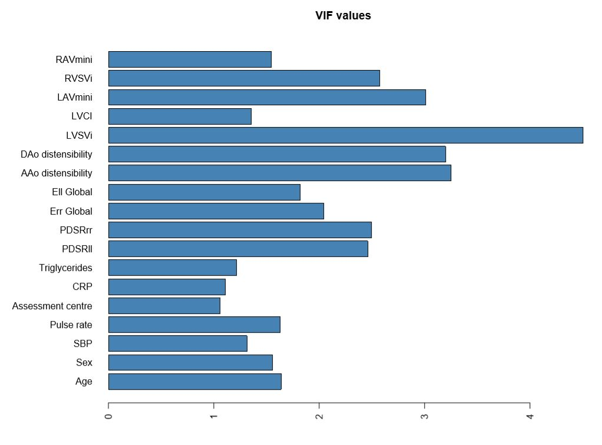

# Cardiac Phenotype associations Pipeline

## Multivariable analysis using LASSO models with model selection for selecting the imaging phenotypes
### Model selection procedure

#### We employed the model selection approach, setting as predictors the three diastolic function parameters, peak diastolic longitudinal strain rates (PDSRll), peak diastolic radial strain rates (PDSRrr) and left atrial maximum volume indexed to BSA (LAVmaxi), and selecting the variables determined by the Extended Bayesian Information Criterion (EBIC) and stability selection on the least absolute shrinkage and selection operator (LASSO) model, to identify phenotype associated with the trait of interest.

 ### LASSO models using 'glmnet'. The parameter of lambda.min was tuned by a 10-fold cross-validation method using 'cv.glmnet' on a training set.
   
####  Inspect the variance inflation factor and exclude variables with VIF > 5 and include one phenotypes for each of the four cardiac chambers (LV, LA, RV, RA), one of the relevant strains (Err, Ell) and two aortic sections (AAo, DAo) where possible to avoid collinearity.
   

    ## Apply LASSO regression

    library(glmnet)  
    
    # position_final - define the final position of the variables selected in the data. 
    # cv.glmnet to train for the lambda parameter 
    data.train<-as.matrix(multivar_data_train[,position_final])

    lambda_min<-matrix(0,ncol = 1, nrow = ncol(data.train))
    for (iT in 1:ncol(data.train)){
      if (iT==2|iT==7){ # the columns with binary data
        cv<-cv.glmnet(data.train[,-iT],data.train[,iT],nfolds = 10, family="binomial", alpha=1)$lambda.min
      } else {
        cv<-cv.glmnet(data.train[,-iT],data.train[,iT],nfolds = 10, alpha=1)$lambda.min
      }
      lambda_min[iT]<-round(cv,5)
    }
    
    # LASSO model using glmnet 
    
    data_selected<-as.matrix(multivar_data_test[,position_final])
    data_selected<-na.omit(data_selected)
    beta_gl<-matrix(0,ncol = ncol(data_selected), nrow = ncol(data_selected)-1)
    for (iS in 1:ncol(data_selected)){
      if (iS==2|iS==7){ # for the logistic regression
        cv<-glmnet(data_selected[,-iS],data_selected[,iS], family="binomial", lambda = lambda_min[iS], alpha=1)
        beta<-as.vector(t(coef(cv)))
        beta<-as.matrix(beta[-1])
    
      } else {
        cv<-glmnet(data_selected[,-iS],data_selected[,iS],lambda = lambda_min[iS], alpha = 1)
        beta<-as.vector(t(coef(cv)))
        beta<-as.matrix(beta[-1])
      }
      beta_gl[,iS]<-beta[,1]
    }

    colnames(beta_gl)<-colnames(data_selected)
    beta_gl<-as.data.frame(beta_gl)
    multivar_beta<-matrix(0,nrow = ncol(beta_gl),ncol=ncol(beta_gl))
    multivar_beta<-as.data.frame(multivar_beta)

## Circos plot  

